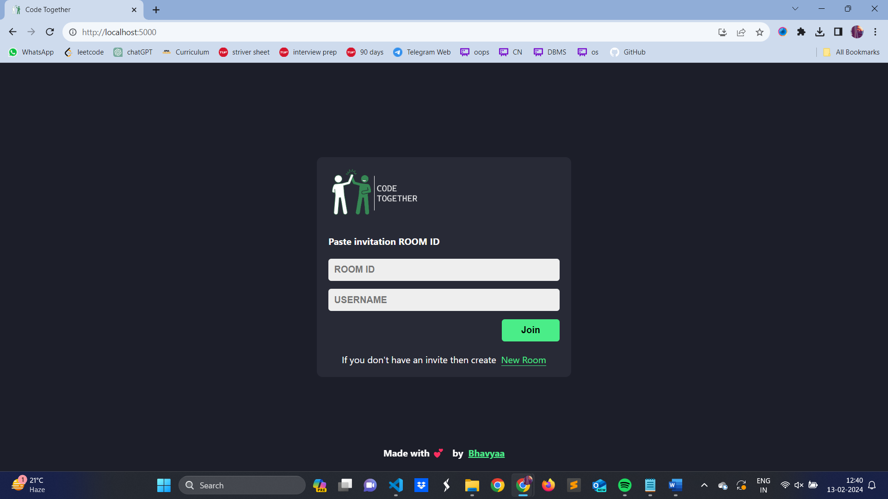
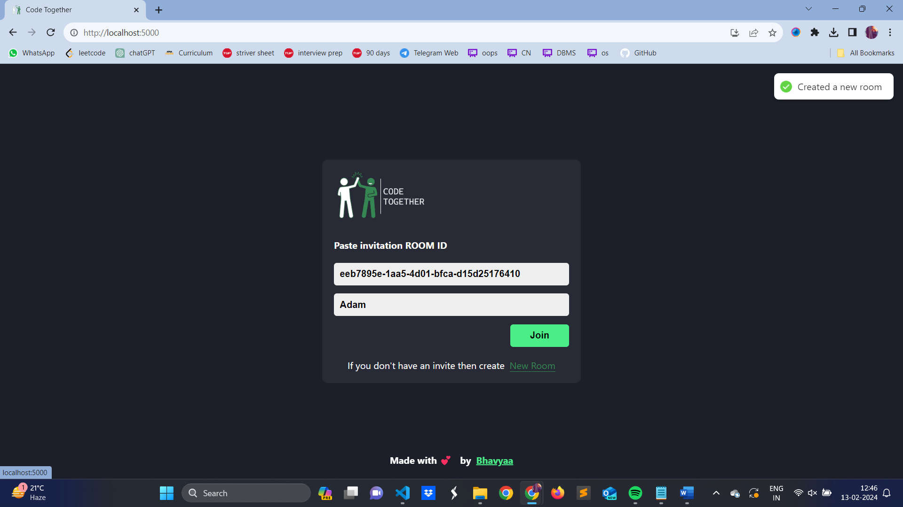
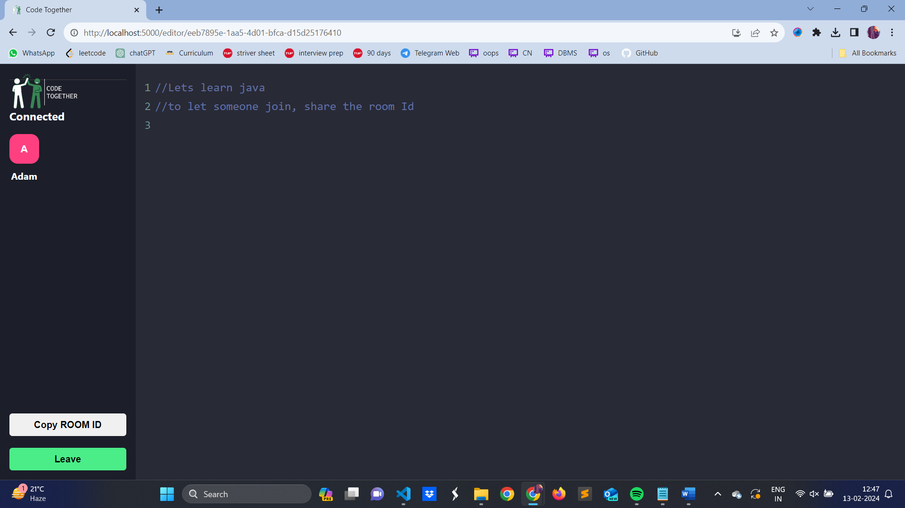

Greetings,

The ubiquity of coding in modern society underscores its importance in various spheres, from academia to e-commerce. 'Code Together' emerges as a small but significant solution to this demand, offering an interactive platform for collaborative coding experiences. Powered by ReactJS, ExpressJS, NodeJS, and socket.io, this project facilitates real-time code editing among peers. Users can create customized coding rooms to suit specific tasks, promoting efficiency and teamwork. 'Code Together' embodies a significant advancement in democratizing coding education and fostering a culture of collaborative learning in the digital era.

Best regards,
Bhavya

Screenshots:

.png>)
.png>)
.png>)